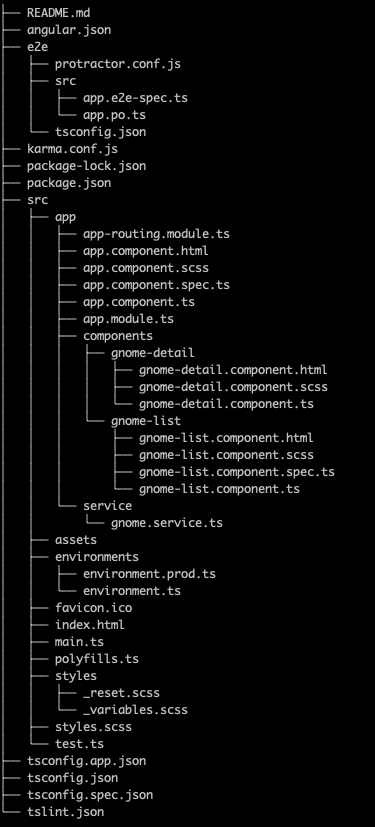

# Altran Challange

The challange consisted in building an app that fetches a gnomes JSON from an external server displaying them all in a list and being able to filter and see the details of each one.

## Technologies used

- Angular version 10.1.7.
- NodeJS version v14.12.0
- SCSS

## Installing and running the project

Width NodeJS already installed in our machine run the following command:

`npm install`

Run the project:

`ng serve`

Navigate to `http://localhost:4200/`.

## Project structure

## Main components

- GnomeListComponent: Here is where I am managing all the data provided by the JSON, It consist in a simple list of gnomes that displays each gnomes picture and name, a filter by profession and a paginator. 
From this component you can navigate to gnomes detail page to see further information about the chosen gnome.

- GnomeDetailComponent:
This component manages all the details about the selected gnome.

## Thoughts 

Something that I would have love to add are interfaces to deal with the data that I was getting from the JSON, however in the instructions was specified that the data may change so I didn't add any.

I have added a paginator to the gnomes list because this is how I would have done it in a real project even though I would be getting the data paginated already and never JSON with 1300 ish entries. Anyway I am aware that im getting the whole JSON.

Thanks for your time!

